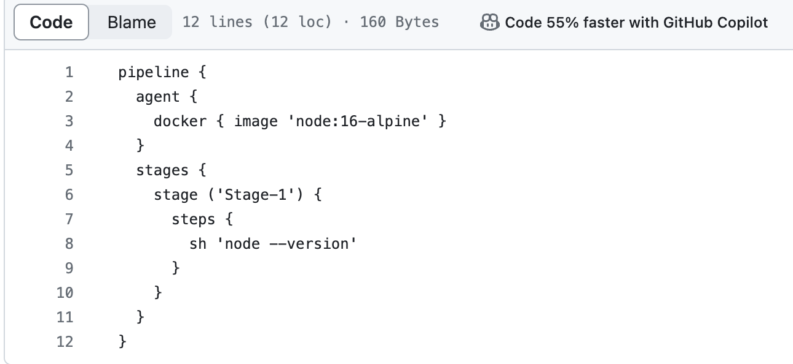

# jenkins_tutorial_1
Building first Jenkins pipelines

Writing Simple script to test the Jenkins Pipeline working. we are using Docker Agent instead of Configuring mulitple Jenkins Slave node.
we are going to use Pipeline option with pull from SCM options in Jenkins, so that Jenkins will find the Jenkins file from this repository and 
will execute all the steps in the Jenkins file.

### The syntax to write jenkins files:
1. It should start with word pipleline with open and closed curly braces with agent details or none agent
   pipeline{
   agent none
   }
 3. Inside the Piepline should have Stages with open and curly braces
    pipeline{
    agent none
      stages{
     }
    }
 5. And Inside the Stages should have one or multiple stage and followed by one or multi steps on each stage
    pipeline{
    agent none
      stages{
        stage('stage1')
         steps {
         sh ' Hello world'
      }
     }
    }
6. make sure the syntax and steps are properly indended.

 

### Some of the Advantages to use Docker agent instead of Jenkins Slave node
1. Jenkins slave nodes configuration has software dependency issues. for example development team A have written python application that runs on python3 version and development team B has some application been running in verion python 2 then we need to create additional slave node. with Docker agent you just use image required for application , install necesary prequisites and test the application in docker container and destory after the build
2. having said that in above point, each team can run their own application without worrying about any dependencies.
3. This saves the additonal resource creation as sometimes the Jenkins slave node will be ideal and not been used. 
